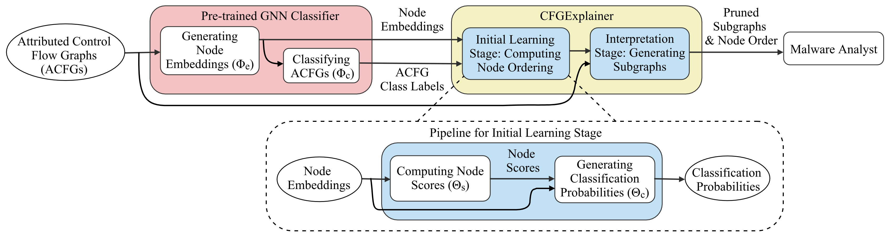

### CFGExplainer: Explaining Graph Neural Network-Based Malware Classification from Control Flow Graphs



CFGExplainer is an interpretability model designed to explain Graph Neural Network (GNN) based malware classification using Control Flow Graphs (CFGs).
This model produces an ordered set of nodes with respect to its usefulness towards malware classification. CFGExplainer also produces the subgraphs pruned based on the identified node ordering. The code provided here are for interpretations considering 11 malware families (i.e., Bagle, Bifrose, Hupigon, Ldpinch, Lmir, Rbot, Sdbot, Swizzor, Vundo, Zbot and Zlob) and one benign class. The requirements for the experiments are in `requirements.txt`.
Please refer the [paper](https://www.dinalherath.com/papers/2022dsn.pdf) for in depth details.

### Running the code

1. `run_train_GCNClassifier.sh`: will run the code for training the GNN classifier model.
2. `run_train_CFGExplainer.sh`: will run the initial learning stage of CFGExplainer.
3. `run_interpret_graphs.sh`: will run the interpret stage of CFGExplainer.

### Interpretability Results

The `interpretability_results/` folder stores the results for running CFGExplainer. For each graph sample the model stores the following:

+ `results_top_blocks.txt`: the ordering of nodes from most important to least important w.r.t the classification task in text format. The file also includes the assembly instructions for each node.
+ `top_blocks.pickle`: the ordering of the nodes saved in pickle format for later analysis if needed.
+ `subgraph_10percent.gpickle`: the subgraph from top 10% nodes in networkx graph pickle format.
+ `subgraph_20percent.gpickle`: the subgraph from top 20% nodes in networkx graph pickle format.

For example, considering the `Bagle` malware family and sample name `Email-Worm.Win32.Bagle.cy.`. The results can be found in folder: `interpretability_results/Bagle/Email-Worm.Win32.Bagle.cy./`. The same folder pattern is followed for results saved for all other malware families. It is possible to save more graphs by changing the code in `exp_interpret_graphs.py` (line 235).

```
@inproceedings{herath2022cfgexplainer,
  title={CFGExplainer: Explaining Graph Neural Network-Based Malware Classification from Control Flow Graphs},
  author={Herath, Jerome Dinal and Wakodikar, Priti Prabhakar and Yang, Ping and Yan, Guanhua},
  booktitle={2022 52nd Annual IEEE/IFIP International Conference on Dependable Systems and Networks (DSN)},
  pages={172--184},
  year={2022},
  organization={IEEE}
}
```
